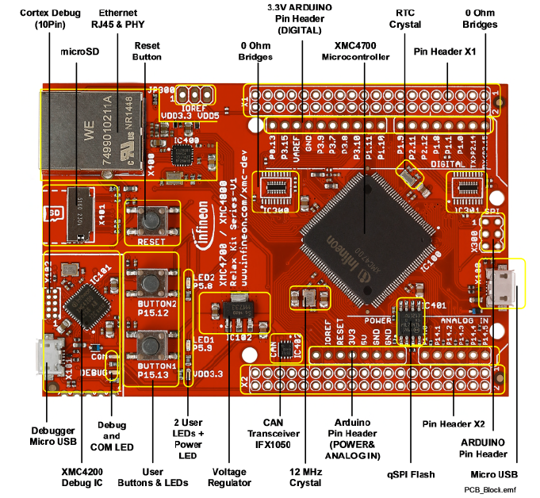
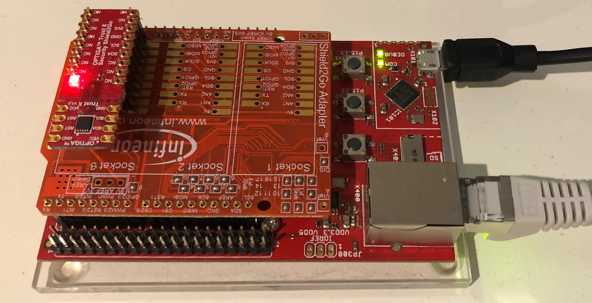
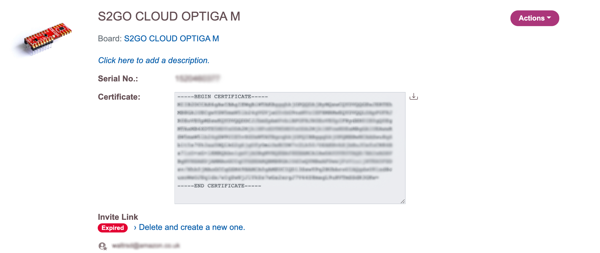
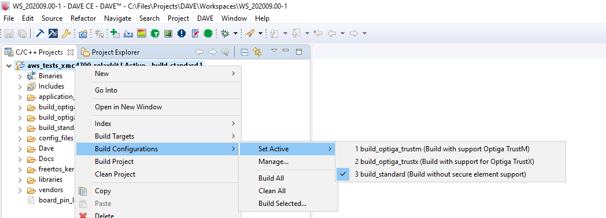

# 1:	Document Information
This document describes how to set up the development environment and run the FreeRTOS MQTT demo on an XMC 4700 Relax Kit.

## 1.1	Revision History (Version, Date, Description of change)
1.0 - 16 Sep 2020 - First version.

# 2: Overview
The XMC4700 device is a member of the XMC4000 family of microcontrollers based on the ARM Cortex-M4 processor core. The growing complexity of today's energy efficient embedded control applications are demanding microcontroller solutions with higher performance CPU cores featuring DSP and FPU capabilities.The XMC4700 family of microcontrollers take advantage of Infineon's decades of experience in the industrial market to provide an optimized solution to meet the performance challenges of today's embedded control applications.

The XMC4700 can be paired with either the OPTIGA™ Trust X or OPTIGA™ Trust M to enable protection of sensitive security tokens on the device, such as X.509 certificates and private keys.

# 3: Hardware Description

## 3.1:	Data Sheets
[XMC4700 Relax Kit](https://www.infineon.com/cms/en/product/evaluation-boards/kit_xmc47_relax_v1/)

[Shield2Go Cloud Security OPTIGA™ Trust M](https://www.infineon.com/cms/en/product/evaluation-boards/s2go-cloud-optiga-m/)

[Shield2Go Security OPTIGA™ Trust X](https://www.infineon.com/cms/en/product/evaluation-boards/s2go-security-optiga-x/)

## 3.2:	Schematic
For PCB schematics, see **Section 3** of the [User Manual](https://www.infineon.com/cms/en/product/evaluation-boards/kit_xmc47_relax_v1/). You can find the User Manual by scrolling down to **Documents** and then **User Manual**.

## 3.3:	Key Components 


For a description of key components, jumper settings, LED descriptions and power requirements, see **Section 2** in the [User Manual](https://www.infineon.com/cms/en/product/evaluation-boards/kit_xmc47_relax_v1/). You can find the User Manual by scrolling down to **Documents** and then **User Manual**.

## 3.4:	Hardware requirements to run FreeRTOS demo

* [XMC4700 Relax Kit](https://www.infineon.com/cms/en/product/evaluation-boards/kit_xmc47_relax_v1/)
* [Sheild2Go My IoT Adapter](https://www.infineon.com/cms/en/product/evaluation-boards/my-iot-adapter/) is required to use with the OPTIGA™ Trust X or OPTIGA™ Trust M evaluation boards
* To enable secure element support, ONE of the following is required:
  * [Shield2Go Cloud Security OPTIGA™ Trust M](https://www.infineon.com/cms/en/product/evaluation-boards/s2go-cloud-optiga-m/)
  * [Shield2Go Security OPTIGA™ Trust X](https://www.infineon.com/cms/en/product/evaluation-boards/s2go-security-optiga-x/)


## 3.5:	Additional Hardware References
Additional hardware documentation packages can be found on the [Infineon XMC4700 Relax Kit product page](https://www.infineon.com/cms/en/product/evaluation-boards/kit_xmc47_relax_v1/#!documents).

# 4:	Setting up the Development Environment
Developers can choose to use either the Infineon DAVE IDE or use CMAKE with command-line or other third party tools and IDEs. DAVE is only supported on Windows, and CMAKE is supported on Windows, Linux and MacOS. Additionally, users will need to install SEGGER JLink tools to access the onboard debugger and flash the device.

If you choose to use DAVE, follow the steps in **Section 4.1** to install DAVE.
If you are using CMAKE, follow **Section 4.2**.

## 4.1:	Install DAVE
Note that DAVE is supported on Windows platforms.

1. Go to Infineon's [DAVE software download](https://infineoncommunity.com/dave-download_ID645) page\.

1. Choose the DAVE package for your operating system and submit your registration information\. After you register, you should receive a confirmation email with a link to download a \.zip file\.

1. Download the DAVE package \.zip file \(`DAVE_version_os_date.zip`\), and unzip it to the location where you want to install DAVE \(for example, `C:\DAVE4`\)\. 
**Note**  
Some Windows users have reported problems using Windows Explorer to unzip the file\. We recommend that you use a third\-party program such as 7\-Zip\.

1. To launch DAVE, run the executable file found in the unzipped `DAVE_version_os_date.zip` folder\.

1. Go to **Section 4.3** to install JLink

## 4.2:	Install CMAKE

1. Set up the GNU Arm Embedded Toolchain\.

   1. Download the toolchain from the [Arm Embedded Toolchain download page](https://developer.arm.com/tools-and-software/open-source-software/developer-tools/gnu-toolchain/gnu-rm/downloads)\. 
**Note**  
Due to [a bug reported](https://bugs.launchpad.net/gcc-arm-embedded/+bug/1810274) in the objcopy utility, we recommend that you download a version other than "8\-2018\-q4\-major\."

   1. Open the downloaded toolchain installer, and follow the instructions in the wizard\.

1. Install CMake and MingW\.

   For instructions, see [CMake Prerequisites](https://docs.aws.amazon.com/freertos/latest/qualificationguide/building-cmake-prereqs.html)\.
   
1. Go to **Section 4.3** to install JLink

## 4.3: Install SEGGER J-Link

To communicate with the XMC4700 Relax Kit's on\-board debugging probe, you need the drivers included in the J\-Link Software and Documentation pack\. You can download the J\-Link Software and Documentation pack from Segger's [J\-Link software download](https://www.segger.com/downloads/jlink/#J-LinkSoftwareAndDocumentationPack) page\.

## 4.4:	Additional Software References
For more information on DAVE IDE, see the [DAVE Quick Start Guide](https://www.infineon.com/dgdl/Infineon-DAVE_Quick_Start-GS-v02_00-EN.pdf?fileId=5546d4624cb7f111014d059f7b8c712d) and visit [DAVE Forum](https://www.infineonforums.com/threads/6212-Install-DAVE%C2%99-IDE-for-XMC%C2%99-microcontrollers)\. 

For more information about using CMake with other operating systems and options, see [Using CMake with FreeRTOS](https://docs.aws.amazon.com/freertos/latest/userguide/getting-started-cmake.html)\.

# 5: Setting up your hardware


To set up the XMC4700 RelaxKit + OPTIGA Security Shield2Go:

1. Connect your computer to the Debugger Micro USB port on your XMC4700 RelaxKit. The On-board USB debug probe is used to program the board and provides Virtual COM Port support for logging purposes.

1. Connect a router or internet-connected Ethernet port to the Ethernet on your XMC4700 RelaxKit.

1. Plug the Infineon MyIoT Adapter in the Arduino Pin Header

1. Plug the Shield2Go Security OPTIGA™ Trust X/M in Socket 3 of the Infineon MyIoT Adapter

# 6: Establishing a serial connection for debugging
To establish a serial connection between your host machine and your board

1. Identify the USB serial port number for the connection to the board on your host computer. In Linux and macOS hosts, this will appear as a device in /dev/. On Windows, this device will appear as a COM device.
2. Start a serial terminal and open a connection with the following settings:
   * Baud rate: 115200
   * Data: 8 bit
   * Parity: None
   * Stop bits: 1
   * Flow control: None

If you are using macOS or Linux, you can use screen. Run the following command:\
```screen /dev/tty.<your serial port> 115200```

If you are using Windows, you will need to install a terminal program.

For more information about installing a terminal and setting up a serial connection, see [Installing a terminal emulator](https://docs.aws.amazon.com/freertos/latest/userguide/uart-term.html). 

# 7: Setup your AWS account and Permissions
To create an AWS account, see [Create and Activate an AWS Account](https://aws.amazon.com/premiumsupport/knowledge-center/create-and-activate-aws-account/)\.

To add an IAM user to your AWS account, see [IAM User Guide](https://docs.aws.amazon.com/IAM/latest/UserGuide/)\. To grant your IAM user account access to AWS IoT and FreeRTOS, attach the following IAM policies to your IAM user account:
+ `AmazonFreeRTOSFullAccess`
+ `AWSIoTFullAccess`

**To attach the AmazonFreeRTOSFullAccess policy to your IAM user**

1. Browse to the [IAM console](https://console.aws.amazon.com/iam/home), and from the navigation pane, choose ** Users**\.

1. Enter your user name in the search text box, and then choose it from the list\.

1. Choose **Add permissions**\.

1. Choose **Attach existing policies directly**\.

1. In the search box, enter **AmazonFreeRTOSFullAccess**, choose it from the list, and then choose **Next: Review**\.

1. Choose **Add permissions**\.

**To attach the AWSIoTFullAccess policy to your IAM user**

1. Browse to the [IAM console](https://console.aws.amazon.com/iam/home), and from the navigation pane, choose ** Users**\.

1. Enter your user name in the search text box, and then choose it from the list\.

1. Choose **Add permissions**\.

1. Choose **Attach existing policies directly**\.

1. In the search box, enter **AWSIoTFullAccess**, choose it from the list, and then choose **Next: Review**\.

1. Choose **Add permissions**\.

For more information about IAM and user accounts, see [IAM User Guide](https://docs.aws.amazon.com/IAM/latest/UserGuide/)\.

For more information about policies, see [IAM Permissions and Policies](https://docs.aws.amazon.com/IAM/latest/UserGuide/introduction_access-management.html)\.

# 8: Download FreeRTOS and Open the Project
This repo uses [Git Submodules](https://git-scm.com/book/en/v2/Git-Tools-Submodules) to bring in dependent components.

Note: If you download the ZIP file provided by GitHub UI, you will not get the contents of the submodules. (The ZIP file is also not a valid git repository)

To clone using HTTPS:
```
git clone https://github.com/Infineon/amazon-freertos.git --recurse-submodules
```
Using SSH:
```
git clone git@github.com:Infineon/amazon-freertos.git --recurse-submodules
```

If you have downloaded the repo without using the `--recurse-submodules` argument, you need to run:
```
git submodule update --init --recursive
```

To checkout the branch with both Trust X and Trust M, you need to run:
```
git checkout feature/trustm
```

If you are using CMAKE and a third party IDE, you can open the source code in your editor of choice.

If you are using DAVE IDE, follow the instructions in **Section 8.1**.

## 8.1: Import the project into DAVE

1. Start DAVE\.

1. In DAVE, choose **File**, and then choose **Import**\. Expand the **Infineon** folder, choose **DAVE Project**, and then choose **Next**\.

1. In the **Import DAVE Projects** window, choose **Select Root Directory**, choose **Browse**, and then choose the XMC4700 demo project\.

   In the directory where you unzipped your FreeRTOS download, the demo project is located in `<freertos>/projects/infineon/xmc4700_relaxkit/dave4/aws_demos`\.

   Make sure that **Copy Projects Into Workspace** is cleared\.

1. Choose **Finish**\.

   The `aws_demos` project should be imported into your workspace and activated\.


# 9: Provision the XMC4700 with AWS IoT
Your board must be registered with AWS IoT to communicate with the AWS Cloud\. To register your board with AWS IoT, you need the following:

**An AWS IoT policy**

The AWS IoT policy grants your device permissions to access AWS IoT resources\. It is stored on the AWS Cloud\.

**An AWS IoT thing**

An AWS IoT thing allows you to manage your devices in AWS IoT\. It is stored on the AWS Cloud\.

**A private key and X\.509 certificate** 

The private key and certificate allow your device to authenticate with AWS IoT\. 

**To create an AWS IoT policy**

1. To create an IAM policy, you need to know your AWS Region and AWS account number\. 

   To find your AWS account number, open the [AWS Management Console](https://console.aws.amazon.com/), locate and expand the menu beneath your account name in the upper\-right corner, and choose **My Account**\. Your account ID is displayed under **Account Settings**\.

   To find the AWS region for your AWS account, use the AWS Command Line Interface\. To install the AWS CLI, follow the instructions in the [AWS Command Line Interface User Guide](https://docs.aws.amazon.com/cli/latest/userguide/cli-chap-install.html)\. After you install the AWS CLI, open a command prompt window and enter the following command:

   ```
   aws iot describe-endpoint
   ```

   The output should look like this:

   ```
   {
       "endpointAddress": "xxxxxxxxxxxxxx.iot.us-west-2.amazonaws.com"
   }
   ```

   In this example, the region is `us-west-2`\.

1. Browse to the [AWS IoT console](https://console.aws.amazon.com/iotv2/)\.

1. In the navigation pane, choose **Secure**, choose **Policies**, and then choose **Create**\.

1. Enter a name to identify your policy\.

1. In the **Add statements** section, choose **Advanced mode**\. Copy and paste the following JSON into the policy editor window\. Replace *aws\-region* and *aws\-account* with your AWS Region and account ID\.

   ```
   {
       "Version": "2012-10-17",
       "Statement": [
       {
           "Effect": "Allow",
           "Action": "iot:Connect",
           "Resource":"arn:aws:iot:aws-region:aws-account-id:*"
       }, 
       {
           "Effect": "Allow",
           "Action": "iot:Publish",
           "Resource": "arn:aws:iot:aws-region:aws-account-id:*"
       },
       {
            "Effect": "Allow",
            "Action": "iot:Subscribe",
            "Resource": "arn:aws:iot:aws-region:aws-account-id:*"
       },
       {
            "Effect": "Allow",
            "Action": "iot:Receive",
            "Resource": "arn:aws:iot:aws-region:aws-account-id:*"
       }
       ]
   }
   ```

   This policy grants the following permissions:  
`iot:Connect`  
Grants your device the permission to connect to the AWS IoT message broker with any client ID\.  
`iot:Publish`  
Grants your device the permission to publish an MQTT message on any MQTT topic\.  
`iot:Subscribe`  
Grants your device the permission to subscribe to any MQTT topic filter\.  
`iot:Receive`  
Grants your device the permission to receive messages from the AWS IoT message broker on any MQTT topic\.

1. Choose **Create**\.

**To create an IoT thing**

1. Browse to the [AWS IoT console](https://console.aws.amazon.com/iotv2/)\.

1. In the navigation pane, choose **Manage**, and then choose **Things**\.

1. If you do not have any IoT things registered in your account, the **You don't have any things yet** page is displayed\. If you see this page, choose **Register a thing**\. Otherwise, choose **Create**\.

1. On the **Creating AWS IoT things** page, choose **Create a single thing**\.

1. On the **Add your device to the thing registry** page, enter a name for your thing, and then choose **Next**\. The thing name should be unique within your account.

1. Finally, choose **Skip certificate and create thing** to complete the Thing registry.

At this point, you will need to attach a certificate and private key to your Thing. This can be accomplished in different ways, based on your device configuration.

* XMC4700 Relax Kit without a secure element, follow **Section 9.1**.
* XMC4700 Relax Kit with OPTIGA Trust X, follow **Section 9.2**
* XMC4700 Relax Kit with OPTIGA Trust M, follow **Section 9.3**

## 9.1: Provision the XMC4700 without a secure element
For a device without a secure element, you can download the certificate and private key from AWS IoT.

1. In the navigation pane for AWS IoT console, choose **Secure** and then choose **Certificates**\.

1. On the **Certificates** page, choose **Create a certficate** 

1. Next to **One\-click certificate creation**, choose **Create certificate**\.

1. Download your private key and certificate by choosing the **Download** links for each\.

1. Choose **Activate** to activate your certificate\. Certificates must be activated prior to use\.

1. Choose **Attach a policy** to attach a policy to your certificate that grants your device access to AWS IoT operations\, and then choose **Done**.

1. You will need to attach your certificate to the Thing you created earlier. On the **Certificates** page, choose the certificate you just created. 

1. Choose **Actions** and then **Attach thing**

1. **Attach things to certificate(s)** will pop up. Choose the Thing name and select **Attach**.

Now that you have your AWS IoT Thing set up, you will need to configure FreeRTOS to send those credentials during the TLS connection.

FreeRTOS is a C language project, and the certificate and private key must be specially formatted to be added to the project\.

**Include the certificates in your FreeRTOS project**

1. In a browser window, open `<your FreeRTOS directory>/tools/certificate_configuration/CertificateConfigurator.html`\.

1. Under **Certificate PEM file**, choose the `ID-certificate.pem.crt` that you downloaded from the AWS IoT console\.

1. Under **Private Key PEM file**, choose the `ID-private.pem.key` that you downloaded from the AWS IoT console\.

1. Choose **Generate and save aws\_clientcredential\_keys\.h**, and then save the file in `demos/include`\. This overwrites the existing file in the directory\.

**Note**  
_The certificate and private key are hard\-coded for demonstration purposes only\. Production\-level applications should store these files in a secure location\._

## 9.2: Provision the XMC4700 with an OPTIGA™ Trust X
In order to protect your sensitive security tokens, the OPTIGA™ Trust X secure element supports on-board key generation. This means that the private key for your device will not leave the secure element.

Follow the instructions described in [Dev Mode Key Provisioning](https://docs.aws.amazon.com/freertos/latest/userguide/dev-mode-key-provisioning.html) **Option #2: onboard private key generation** to generate a private key on your device, a self signed X.509 certificate, and a Certificate Authority. For instructions on how to build and flash the device, refer to **Section 11: Build and run the FreeRTOS demo**.

## 9.3: Provision the XMC4700 with an OPTIGA™ Trust M
The OPTIGA™  Trust M supports 2 modes for device provisioning. 

If you want to use your own certificate authority, you can follow the instructions described in [Dev Mode Key Provisioning](https://docs.aws.amazon.com/freertos/latest/userguide/dev-mode-key-provisioning.html) **Option #2: onboard private key generation** to generate a private key on your device, a self signed X.509 certificate, and a Certificate Authority.

The OPTIGA Trust M comes pre-provisioned with a certificate signed with Infineon's OPTIGA(TM) Trust M CA and a private key, and can make use of the [AWS IoT Multi-Account Registration](https://aws.amazon.com/about-aws/whats-new/2020/04/simplify-iot-device-registration-and-easily-move-devices-between-aws-accounts-with-aws-iot-core-multi-account-registration/) feature. To retrieve the certificate from the OPTIGA Trust M, and register it with AWS IoT using Multi-Account Registration, follow the instructions below.

**Download the certificate from the OPTIGA™ Trust M with Infineon Toolbox**

If you have the [Shield2Go Cloud Security OPTIGA™ Trust M](https://www.infineon.com/cms/en/product/evaluation-boards/s2go-cloud-optiga-m/) variant, you can obtain the certificate that is pre-loaded on the secure element with the [Infineon Toolbox](https://softwaretools.infineon.com/). Follow the steps below to retrieve your certificate:

1. Under **First Steps** choose **please register**.

1. If you have a QR Code, choose **Scan QR code** and follow the instructions. Otherwise, if you have the Serial number, choose **Enter Serial Number** and enter the Serial Number on the next page.

1. After inputting your serial number or QR code, the Shield2Go Cloud Security OPTIGA™ Trust M should appear in the browser. Choose **View Details**.

1. The public X.509 certificate that is present on your device should be displayed. Copy or download this certificate to your local environment.



**Register the certificate with AWS IoT**

1. In the navigation pane for AWS IoT console, choose **Secure** and then choose **Certificates**\.

1. On the **Certificates** page, choose **Create a certificate** 

1. Next to **Use my certificate**, choose **Get started**\.

1. On the **Select a CA** page, leave this blank and choose **Next**. Multi-Account Registration does not require the user to register a Certificate Authority with AWS.

1. On the **Register existing device certificates** page, choose **Select certificates** and choose the certificate that you downloaded from Infineon Toolbox.

1. Ensure that the **Activate All** option is selected and click on **Register certificate**.

1. Choose **Actions** and **Attach policy** to attach the policy that you created, and then choose **Attach**.

1. You will need to attach your certificate to the Thing you created earlier. On the **Certificates** page, choose the certificate you just created. 

1. Choose **Actions** and then **Attach thing**

1. **Attach things to certificate(s)** will pop up. Choose the Thing name and select **Attach**.

**Configure PKCS#11 on FreeRTOS**

The certificate is already pre-loaded on the OPTIGA™ Trust M, you will not need to add the certificate to the FreeRTOS code. Instead, you will specify the PKCS#11 labels for the OPTIGA™ Trust M's certificate and private key slots.

1. Open the file ``demos/config_files/iot_pkcs11_config.h``

1. Set ``pkcs11configLABEL_DEVICE_PRIVATE_KEY_FOR_TLS`` to ``0xE0F0``

1. Set ``pkcs11configLABEL_DEVICE_CERTIFICATE_FOR_TLS`` to ``0xE0E0``

1. Open the file ``demos/include/aws_clientcredential_keys.h``.

1. Ensure ``keyJITR_DEVICE_CERTIFICATE_AUTHORITY_PEM``, ``keyCLIENT_CERTIFICATE_PEM``, and ``keyCLIENT_PRIVATE_KEY_PEM`` are set to ``""``.

# 10: Configure FreeRTOS
You need to provide FreeRTOS with your AWS IoT endpoint so the application running on your board can send requests to the correct endpoint\.

1. Browse to the [AWS IoT console](https://console.aws.amazon.com/iotv2/)\.

1. In the navigation pane, choose **Settings**\.

   Your AWS IoT endpoint is displayed in **Endpoint**\. It should look like `1234567890123-ats.iot.us-east-1.amazonaws.com`\. Make a note of this endpoint\.

1. In the navigation pane, choose **Manage**, and then choose **Things**\.

   Your device should have an AWS IoT thing name\. Make a note of this name\.

1. Open `/demos/include/aws_clientcredential.h`\. 

1. Specify values for the following constants:
   + `#define clientcredentialMQTT_BROKER_ENDPOINT "Your AWS IoT endpoint";`
   + `#define clientcredentialIOT_THING_NAME "The AWS IoT thing name of your board"`

# 11: Build and run the FreeRTOS demo 

Building FreeRTOS can be accomplished with DAVE IDE or with CMAKE. If you are using DAVE IDE, please follow **Section 11.1**, if you're using CMAKE follow section **11.2**.

## 11.1: Build and run with DAVE

1. First, you will need to set the secure element configuration for your board. Right click the Project and navigate to **Build Configurations** and then **Set Active**. 

2. In the **Set Active** menu, choose **build_standard** if you are not using a secure element, **build_optiga_trustm** with the OPTIGA™ Trust M, or **build_optiga_trustx** with the OPTIGA™ Trust X.



3. From the **Project** menu, choose **Build Active Project**\. 

   Make sure that the project builds without errors\.

4. From **Project Explorer**, right\-click `aws_demos`, choose **Debug As**, and then choose **DAVE C/C\+\+ Application**\.

5. Double\-click **GDB SEGGER J\-Link Debugging** to create a debug confirmation\. Choose **Debug**\.

6. When the debugger stops at the breakpoint in `main()`, from the **Run** menu, choose **Resume**\.

## 11.2:  Build and run with CMAKE

1. From the FreeRTOS root directory, run the following cmake commands:

   **XMC4700 Relax Kit without a secure element**\
   ```cmake -DVENDOR=infineon -DBOARD=xmc4700_relaxkit -DCOMPILER=arm-gcc -S. -B ./build -DAFR_ENABLE_TESTS=0 -DAFR_TOOLCHAIN_PATH=<path to gcc compiler>/bin```

   **XMC4700 Relax Kit with OPTIGA Trust X**\
   ```cmake -DVENDOR=infineon -DBOARD=xmc4700_relaxkit -DCONFIG_USE_OPTIGA=TRUST_X -DCOMPILER=arm-gcc -S. -B ./build -DAFR_ENABLE_TESTS=0 -DAFR_TOOLCHAIN_PATH=<path to gcc compiler>/bin```

   **XMC4700 Relax Kit with OPTIGA Trust M**\
   ```cmake -DVENDOR=infineon -DBOARD=xmc4700_relaxkit -DCONFIG_USE_OPTIGA=TRUST_M -DCOMPILER=arm-gcc -S. -B ./build -DAFR_ENABLE_TESTS=0 -DAFR_TOOLCHAIN_PATH=<path to gcc compiler>/bin```

   **Note:** _Be sure to replace <path to gcc compiler> with the absolute path to your folder containing the GCC compiler._

   The output of the CMAKE configuration should be similar to the following:

   ```
   -- The C compiler identification is GNU 9.2.1
   -- The CXX compiler identification is unknown
   -- The ASM compiler identification is GNU
   -- Found assembler: ~/workspace/gcc-arm/bin/arm-none-eabi-gcc
   -- Found Git: /usr/bin/git (found version "2.24.3 (Apple Git-128)") 
   -- Submodule update
   =========================Resolving dependencies==========================
   module disabled: ble_hal
   reason:          ble_hal::mcu_port is not defined by vendor.
   dependency path: ble->ble_hal->ble_hal::mcu_port

   module disabled: wifi
   reason:          wifi::mcu_port is not defined by vendor.
   dependency path: ble_wifi_provisioning->wifi->wifi::mcu_port

   module disabled: ota
   reason:          ota::mcu_port is not defined by vendor.
   dependency path: ota->ota::mcu_port


   ====================Configuration for FreeRTOS====================
   Version:                 202002.00
   Git version:             201910.00-469-gce23016da

   Target microcontroller:
   vendor:                  Infineon
   board:                   XMC4700 Relax Kit
   description:             Development kit for ARM Cortex-M4 based XMC4700 MCU
   family:                  XMC4x00
   data ram size:           352KB
   program memory size:     2MB

   Host platform:
   OS:                      Darwin-19.6.0
   Toolchain:               arm-gcc
   Toolchain path:          ~/workspace/gcc-arm
   CMake generator:         Unix Makefiles

   FreeRTOS modules:
   Modules to build:        common, crypto, defender, dev_mode_key_provisioning, 
                              freertos_plus_tcp, greengrass, https, kernel, mqtt, pkcs11, 
                              pkcs11_implementation, platform, posix, secure_sockets, 
                              serializer, shadow, tls
   Enabled by user:         defender, greengrass, https, mqtt, pkcs11, pkcs11_
                              implementation, platform, posix, secure_sockets, shadow
   Enabled by dependency:   common, crypto, demo_base, dev_mode_key_provisioning, 
                              freertos, freertos_plus_posix, freertos_plus_tcp, kernel, 
                              secure_sockets_freertos_plus_tcp, serializer, tls, utils
   3rdparty dependencies:   http_parser, jsmn, mbedtls, pkcs11, tinycbor
   Available demos:         demo_defender, demo_greengrass_connectivity, demo_https, 
                              demo_mqtt, demo_posix, demo_shadow, demo_tcp
   Available tests:         
   =========================================================================

   -- Configuring done
   -- Generating done
   -- Build files have been written to: ~/amazon-freertos/build
   ```

2. To build the project, run the following from the root FreeRTOS directory:\

   ```cmake --build ./build --parallel 8```

   A successful build will output similar to the following:
   ```
   [ 98%] Building C object CMakeFiles/aws_demos.dir/demos/tcp/aws_tcp_echo_client_single_task.c.obj
   [100%] Linking C executable aws_demos.elf
      text	   data	    bss	    dec	    hex	filename
   191716	   1692	 152092	 345500	  5459c	<path to freertos>/build/aws_demos.elf
   ```


 3. Flash and run the image with [JLINK](https://www.segger.com/downloads/jlink/#J-LinkSoftwareAndDocumentationPack)\. From the build directory \(*<BUILD\_FOLDER>*\), use the following commands to create a flash script:

      ```
      echo loadfile aws_demos.hex > flash.jlink
      echo r >> flash.jlink
      echo g >> flash.jlink
      echo q >> flash.jlink
      ```

4. Flash the image using the JLink executable\.

   ```
   <JLINK_PATH>\JLink.exe  -device XMC4700-2048 -if SWD -speed auto -CommanderScript flash.jlink
   ```

A successful run of the FreeRTOS MQTT Demo should have an output similar to the following in the serial console. See **Section 6** for more information on how to enable serial output.

```
0 0 [Tmr Svc] Starting key provisioning...
1 1 [Tmr Svc] Write root certificate...
2 4 [Tmr Svc] Write device private key...
3 82 [Tmr Svc] Write device certificate...
4 86 [Tmr Svc] Key provisioning done...
5 291 [Tmr Svc] Wi-Fi module initialized. Connecting to AP...
.6 8046 [Tmr Svc] Wi-Fi Connected to AP. Creating tasks which use network...
7 8058 [Tmr Svc] IP Address acquired [IP Address]
8 8058 [Tmr Svc] Creating MQTT Echo Task...
9 8059 [MQTTEcho] MQTT echo attempting to connect to [MQTT Broker].
...10 23010 [MQTTEcho] MQTT echo connected.
11 23010 [MQTTEcho] MQTT echo test echoing task created.
.12 26011 [MQTTEcho] MQTT Echo demo subscribed to iotdemo/#
13 29012 [MQTTEcho] Echo successfully published 'Hello World 0'
.14 32096 [Echoing] Message returned with ACK: 'Hello World 0 ACK'
.15 37013 [MQTTEcho] Echo successfully published 'Hello World 1'
16 40080 [Echoing] Message returned with ACK: 'Hello World 1 ACK'
.17 45014 [MQTTEcho] Echo successfully published 'Hello World 2'
.18 48091 [Echoing] Message returned with ACK: 'Hello World 2 ACK'
.19 53015 [MQTTEcho] Echo successfully published 'Hello World 3'
.20 56087 [Echoing] Message returned with ACK: 'Hello World 3 ACK'
.21 61016 [MQTTEcho] Echo successfully published 'Hello World 4'
22 64083 [Echoing] Message returned with ACK: 'Hello World 4 ACK'
.23 69017 [MQTTEcho] Echo successfully published 'Hello World 5'
.24 72091 [Echoing] Message returned with ACK: 'Hello World 5 ACK'
.25 77018 [MQTTEcho] Echo successfully published 'Hello World 6'
26 80085 [Echoing] Message returned with ACK: 'Hello World 6 ACK'
.27 85019 [MQTTEcho] Echo successfully published 'Hello World 7'
.28 88086 [Echoing] Message returned with ACK: 'Hello World 7 ACK'
.29 93020 [MQTTEcho] Echo successfully published 'Hello World 8'
.30 96088 [Echoing] Message returned with ACK: 'Hello World 8 ACK'
.31 101021 [MQTTEcho] Echo successfully published 'Hello World 9'
32 104102 [Echoing] Message returned with ACK: 'Hello World 9 ACK'
.33 109022 [MQTTEcho] Echo successfully published 'Hello World 10'
.34 112047 [Echoing] Message returned with ACK: 'Hello World 10 ACK'
.35 117023 [MQTTEcho] Echo successfully published 'Hello World 11'
36 120089 [Echoing] Message returned with ACK: 'Hello World 11 ACK'
.37 122068 [MQTTEcho] MQTT echo demo finished.
38 122068 [MQTTEcho] ----Demo finished----
```


You can use the MQTT client in the AWS IoT console to monitor the messages that your device sends to the AWS Cloud\. You might want to set this up before the device runs the demo project\.

**To subscribe to the MQTT topic with the AWS IoT MQTT client**

1. Sign in to the [AWS IoT console](https://console.aws.amazon.com/iotv2/)\.

1. In the navigation pane, choose **Test** to open the MQTT client\.

1. In **Subscription topic**, enter **iotdemo/\#**, and then choose **Subscribe to topic**\.

# 12: Troubleshooting
For general troubleshooting information, see [Troubleshooting Getting Started](https://github.com/awsdocs/aws-freertos-docs/blob/master/doc_source/userguide/gsg-troubleshooting.md)\.

